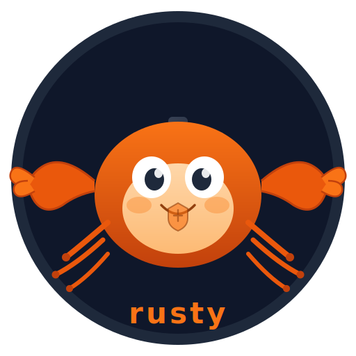

<p align="center">
  
</p>

<h1 align="center">rusty</h1>

<p align="center">A policy-aware WASM execution platform for portable, sandboxed, plugin-hosted tools.</p>

Instead of giving agents raw functions, shell access, or direct API clients, rusty exposes portable plugin actions that run inside a controlled host. Every action is typed, inspectable, traceable, permissioned, and isolated.

## How it works

1. **Tools are WASM plugins.** Authors write plugins in Rust (or any language targeting `wasm32-wasip2`), declaring actions with typed input/output schemas.
2. **The host brokers all side effects.** Plugins can't touch the filesystem, network, or secrets directly. They request operations through a governed host API.
3. **Policies control execution.** A first-match-wins rule engine evaluates every invocation — allow, deny, or require approval — based on action kind, capabilities, tags, or plugin identity.
4. **Everything is traced.** Every invocation produces a structured execution trace: validation, policy decision, host calls, timing, and result.

## Quick start

### Prerequisites

- Rust stable (1.78+)
- `wasm32-wasip2` target: `rustup target add wasm32-wasip2`

### Install

```bash
cargo build --release -p rusty-cli
# optionally add to PATH:
cp target/release/rusty ~/.cargo/bin/
```

### Create a plugin in 3 commands

```bash
rusty init my-plugin
cd my-plugin
rusty build
```

That's it. `rusty init` scaffolds the manifest, Cargo.toml, and source with all the WIT boilerplate. `rusty build` compiles to `wasm32-wasip2` and copies the `.wasm` with the correct filename.

### Install and run

```bash
rusty install .
rusty invoke my-plugin hello --input '{"name": "World"}'
```

### Full CLI

```bash
rusty init <name>           # scaffold a new plugin project
rusty build [path]          # compile plugin to WASM
rusty install <path>        # install a plugin
rusty list                  # list installed plugins
rusty inspect <plugin-id>   # show manifest, schemas, capabilities
rusty invoke <plugin> <action> --input '...'   # invoke an action
rusty invoke <plugin> <action> --input '...' --trace  # with execution trace
rusty trace <run-id>        # retrieve a saved trace
```

### Schema validation

```bash
# Invalid input is rejected before the plugin ever executes
rusty invoke my-plugin hello --input '{}'
# => error: [validation_failed] "name" is a required property
```

### Policy enforcement

Create `~/.rusty/policy.toml`:

```toml
default-effect = "deny"

[[rules]]
id = "allow-read-only"
effect = "allow"
match-action-kind = "read-only"

[[rules]]
id = "approve-destructive"
effect = "require-approval"
match-action-kind = "destructive"
```

## Writing a plugin

The fastest path is `rusty init`:

```bash
rusty init my-plugin
cd my-plugin
# edit rusty-plugin.toml and src/lib.rs
rusty build
rusty install .
```

`rusty init` generates three files:

**`rusty-plugin.toml`** — manifest declaring metadata, actions, and capabilities:

```toml
[plugin]
id = "my-plugin"
name = "my-plugin"
version = "0.1.0"
author = ""
description = ""

capabilities = []

[[actions]]
id = "hello"
title = "Hello"
description = "A starter action"
kind = "read-only"
approval = "none-required"
tags = []
capabilities = []

[actions.input-schema]
type = "object"
required = ["name"]

[actions.input-schema.properties.name]
type = "string"

[actions.output-schema]
type = "object"
required = ["message"]

[actions.output-schema.properties.message]
type = "string"
```

**`src/lib.rs`** — implement the guest interface:

```rust
use rusty_plugin_sdk::{from_json, to_json};

wit_bindgen::generate!({
    inline: rusty_plugin_sdk::PLUGIN_WIT,
});

use exports::rusty::plugin::guest::Guest;
use rusty::plugin::host_api;
use rusty::plugin::types::*;

struct Plugin;

impl Guest for Plugin {
    fn get_info() -> PluginInfo { /* ... */ }
    fn list_actions() -> Vec<ActionDef> { /* ... */ }

    fn invoke(action_id: String, input: String) -> ActionResult {
        host_api::log(LogLevel::Info, &format!("invoking {action_id}"));

        match action_id.as_str() {
            "hello" => {
                let parsed: serde_json::Value = from_json(&input).unwrap();
                let name = parsed["name"].as_str().unwrap_or("world");
                ActionResult::Ok(to_json(&serde_json::json!({
                    "message": format!("Hello, {name}!")
                })))
            }
            _ => ActionResult::Err(ActionError {
                code: "unknown_action".into(),
                message: format!("unknown action: {action_id}"),
                details: None,
            }),
        }
    }
}

export!(Plugin);
```

Build and install:

```bash
rusty build
rusty install .
rusty invoke my-plugin hello --input '{"name": "World"}'
```

## Architecture

```
rusty/
├── crates/
│   ├── rusty-core        # Shared types: manifest, action, capability, policy, trace, invocation
│   ├── rusty-wit         # WIT interface definitions + wasmtime bindgen host bindings
│   ├── rusty-engine      # Plugin loading, invocation lifecycle, registry
│   ├── rusty-policy      # First-match-wins policy rule engine
│   ├── rusty-cli         # CLI binary (init, build, install, list, inspect, invoke, trace)
│   └── rusty-plugin-sdk  # Guest-side SDK for plugin authors
└── examples/plugins/
    └── hello-world       # Example plugin
```

### Invocation lifecycle

Every action invocation follows a strict state machine:

```
requested → validated → policy-evaluated → approved → scheduled → started → completed
                │              │                                       │
                └→ failed      ├→ denied                               ├→ failed
                  (schema)     └→ denied                               ├→ timed-out
                                 (approval required)                   └→ cancelled
```

### Host API (WIT)

Plugins import a `host-api` interface for controlled side effects:

- `log(level, message)` — structured logging through the host
- `get-config(key)` — read host-provided configuration
- `emit-event(type, payload)` — emit custom trace events

All host calls are recorded in the execution trace.

### Key design decisions

- **Fresh WASM Store per invocation** — complete memory isolation between calls
- **Pre-instantiation** (`PluginWorldPre`) — validates exports at install time, not invoke time
- **Fuel-based metering** — deterministic per-instruction accounting with async yield
- **Schema validation before execution** — bad input never reaches the plugin
- **First-match-wins policy** — simple, predictable, auditable (like firewall rules)

## Tests

```bash
cargo test --workspace
```

70 tests across four layers:
- **27 unit tests** in `rusty-core` — manifest parsing, schema validation, policy config, action/capability enums, invocation lifecycle, trace events
- **6 unit tests** in `rusty-policy` — rule matching, first-match-wins, multi-condition AND logic
- **21 integration tests** in `rusty-engine` — plugin loading, invoke success/failure, schema rejection, policy enforcement, cancellation, registry operations, isolation
- **16 CLI tests** in `rusty-cli` — init, build, install, list, inspect, invoke, trace (success and error paths)

## Agent SDK integration

The `tests/agent-sdk/` directory contains a test that exposes rusty plugin actions as MCP tools for the [Claude Agent SDK](https://docs.anthropic.com/en/docs/agents/agent-sdk). A Claude agent autonomously discovers plugins, inspects schemas, invokes actions, and handles validation errors — demonstrating rusty as an execution substrate for AI agents.

## License

MIT
